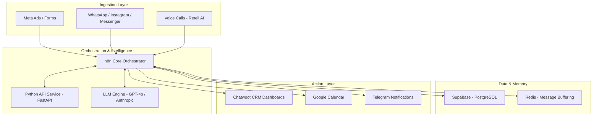

# 🧩 AI-Powered Enterprise Automation & Orchestration Ecosystem

This repository is a production-grade, modular orchestration platform designed for high-scale sales, customer support, and marketing automation. It bridges the gap between fragmented SaaS tools and a unified, data-driven business operating system using **n8n**, **Agentic AI**, and **Microservices**.

Developed by a **Senior Automation Engineer & AI Workflow Architect**, this ecosystem demonstrates professional-grade architecture, emphasizing **state persistence**, **microservice communication**, and **intelligent intent classification**.

---

## 🏗️ System Architecture & Data Flow

The platform follows a **Domain-Driven Design (DDD)**, where independent services are orchestrated by a central n8n engine and share a Single Source of Truth via Supabase.



---

## 🚫 The Problem Solved

Traditional business workflows often suffer from:
1.  **Response Latency:** Human agents taking hours to qualify a lead.
2.  **Fragmented Data:** Customer history split across WhatsApp, Email, and CRM.
3.  **Low Scalability:** Inbound volume bottlenecks due to manual processing.
4.  **Inconsistent Intent:** Human error in classifying lead quality or urgent support tickets.

### ✅ The Solution: This Ecosystem
This platform solves these issues by automating the **Data → Intelligence → Action** loop. It qualifies leads in seconds, maintains a 360° view of customer memory, and ensures that human involvement is only required for high-value closures.

---

## 📂 Core Module Deep-Dive

### 1. 🎯 [Customer Excellence Suite](./customer_service_&_lead_tracking)
The primary engine for conversion and retention.
*   **[AI Lead Scoring Pipeline](./customer_service_&_lead_tracking/AI_lead_scoring_pipeline)**: A proprietary Python-based algorithm that calculates "Lead Heat" based on budget, company size, and sentiment.
*   **[Multichannel Inbox](./customer_service_&_lead_tracking/inbox_lead_to_customer)**: Synchronizes WhatsApp, Instagram, and Messenger into a unified data stream with persistent memory.
*   **[Chatwoot Dashboards](./customer_service_&_lead_tracking/chatwoot_dashboards)**: Custom interactive extensions for managing appointments and CRM data within the chat window.

### 2. 📞 [Inbound Voice Intelligence](./inbound_calls)
AI VOICE agents that handle real-time phone calls.
*   **Retell AI Integration**: Capable of natural, human-like conversations.
*   **Real-time Tooling**: The voice agent can check availability in Google Calendar and book or reschedule meetings while on the phone with the customer.

### 3. 📱 [Social Media & Content Automation](./social_networks)
Microservices for brand scaling and community management.
*   **Sentiment-Aware Bots**: Automated DM and comment management that detects "Complaint" vs. "Purchase Intent" using LLMs.
*   **automated content generation**: Logic for AI-driven post scheduling and community engagement.

### 4. 🐍 [Internal Python API](./python_api)
Dedicated FastAPI backend for tasks that require heavy computation:
*   Advanced lead scoring algorithms.
*   Complex data normalization and business logic that exceeds standard no-code capabilities.

---

## 🌐 External Service Ecosystem

This platform acts as an orchestrator, seamlessly integrating specialized APIs:
*   **Intelligence:** OpenAI (GPT-4o) & Anthropic (Claude) for reasoning.
*   **Voice:** Retell AI for high-fidelity phone interfaces.
*   **CRM/Helpdesk:** Chatwoot.
*   **Productivity:** Google Workspace (Calendar) via OAuth2.
*   **Messaging:** Meta Graph API (WhatsApp/Instagram/Facebook), Telegram API.
*   **Persistence:** Supabase (PostgreSQL) + Redis for high-concurrency buffering.

---

## 🚀 Deployment Guide

Follow these steps to deploy the production ecosystem using Docker.

### 1. Environment Configuration
Create a `.env` file in the root based on [`n8n-config/.env`](./n8n-config/.env). Required variables:
```env
# Database
SUPABASE_URL=your_project_url
SUPABASE_SERVICE_ROLE_KEY=your_key

# Intelligence
OPENAI_API_KEY=your_openai_key
RETELLAI_API_KEY=your_voice_agent_key

# Messaging
WHATSAPP_API_TOKEN=your_meta_token
TELEGRAM_BOT_TOKEN=your_telegram_token
```

### 2. Infrastructure Deployment
Run the optimized Docker configuration to spin up the entire stack:
```bash
docker-compose -f n8n-config/docker-compose.yml up -d
```
*Includes: n8n (Queue Mode), Redis, PostgreSQL, and Python API service.*

### 3. Workflow Import
1. Access your n8n instance.
2. Import the JSON files from each module.
3. Configure the **Credential IDs** within n8n to match your environment.

### 4. Database Setup
Execute the SQL schema in your Supabase SQL Editor:
*   [`DB_supabase_SQL/CLEAN_SCHEMA_SANITIZED.sql`](./DB_supabase_SQL/CLEAN_SCHEMA_SANITIZED.sql)

---

## 👨‍💻 Professional Summary

This platform represents a fusion of **Full-Stack Development** and **Workflow Engineering**. It isn’t just a collection of "if-then" statements; it is a **scalable, resilient, and intelligent automation ecosystem** built for high-performance business environments.

**Key Technical Skills Demonstrated:**
*   **Agentic AI Orchestration** (Multi-agent workflows).
*   **Database Design** (SSOT pattern with Supabase).
*   **Microservice Interconnectivity** (FastAPI + n8n).
*   **Multichannel Messaging Integration** (Meta/WA/Web).

---
**Senior Automation Engineer | AI Workflow Architect | Backend Developer**
