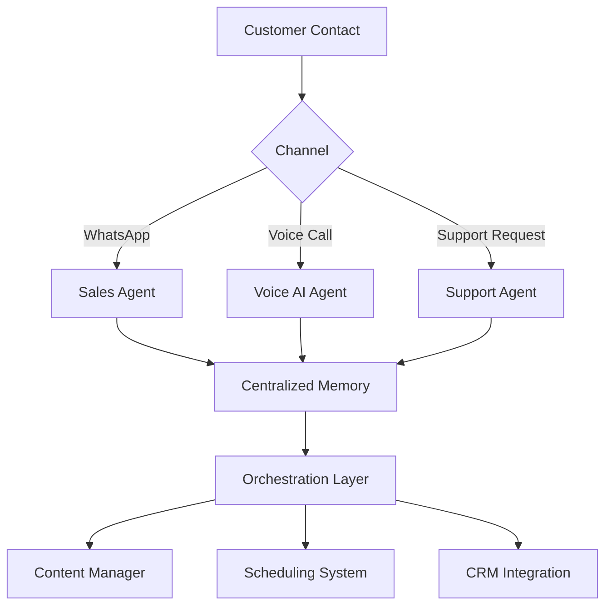

# 🤖 n8n Automation Portfolio

**Santiago Emiliano Ramírez Vázquez**  
*Automation & AI Specialist*

---

## 👋 Overview

This repository contains a curated portfolio of **production-ready n8n workflows** designed and implemented by Santiago Emiliano Ramírez Vázquez, focused on:

- 🧠 **AI agents**
- 📡 **Omnichannel automation**
- 💼 **Sales, marketing, and customer support workflows**
- 📱 **WhatsApp, voice agents, and social media automation**
- 🗄️ **Centralized data, memory, and orchestration using n8n**

Each project is composed of **multiple modular workflows** (JSON files) that work together as a complete automation system.

---

## 🏗️ Architecture Philosophy

All workflows follow these principles:

✅ **Modular design** (each JSON has a single responsibility)  
✅ **Centralized data & memory**  
✅ **Event-driven orchestration**  
✅ **Scalable and extensible**  
✅ **Multi-agent architecture** (AI agents with specialized roles)

---

## 📂 Projects & Files Description

### 🟢 1. Cold B2B Sales & WhatsApp Automation

**Purpose:** End-to-end cold B2B prospecting, lead qualification, and automated appointment scheduling using WhatsApp.

#### Files

| File | Description |
|------|-------------|
| `AGENTE DE VENTAS B2B WA (1).json` | **Main AI Sales Agent workflow** • Handles conversations with B2B prospects via WhatsApp • Personalizes responses using enriched company data • Moves prospects through sales funnel stages (Lead → Contacted → Meeting Booked) |
| `enviar cold WA (13).json` | **Cold outreach dispatcher** • Sends outbound WhatsApp messages • Controls rate limits and delivery logic • Prevents duplicate outreach |
| `agendamiento y ventas B2B COLD (4).json` | **Sales + scheduling orchestration** • Manages meeting booking • Integrates calendar logic • Normalizes timezones based on prospect location |

---

### 🟣 2. Voice AI Agent – Retell AI (Inbound Calls)

**Purpose:** Provide real-time AI assistance during inbound voice calls with live access to customer data and scheduling tools.

#### Files

| File | Description |
|------|-------------|
| `inbound_calls_retellAI_agent(EN).json` | **Inbound voice agent logic** • Triggered when a call is received • Provides contextual customer information • Guides the voice AI conversation dynamically |
| `herramientas_agenteRetellAI (40).json` | **Tooling layer for the voice agent** • Google Calendar tools (schedule, cancel, reschedule) • Data lookup and validation • Exposed as callable tools for the voice agent |
| `enviar_data (22).json` | **Data sharing utility** *(Shared with other projects)* • Passes structured customer and call data • Ensures consistency across voice and chat channels |

---

### 🔵 3. AI Content Creation for Social Media

**Purpose:** Automated creation and publishing of AI-generated images and videos for social media platforms.

#### Files

| File | Description |
|------|-------------|
| `AGENTE CONTENT MANAGER (2).json` | **Central content orchestration agent** • Decides content type (image or video) • Assigns tasks to specialized creation workflows • Maintains content metadata and state |
| `creador de IMAGENES redes sociales (8).json` | **Image generation workflow** • Generates AI images based on business goals • Stores assets and metadata • Prepares content for publishing |
| `creador de VIDEOS redes sociales (15).json` | **Video generation workflow** • Creates AI-generated videos (e.g. SORA-style workflows) • Generates prompts, scenes, and scripts • Stores output references |
| `publicar en redes sociales (23).json` | **Publishing automation** • Publishes content to social platforms • Generates captions and copy automatically • Supports scheduled or immediate posting |

---

### 🟠 4. Customer Support & Complaint Resolution (Omnichannel)

**Purpose:** Automated customer support system with AI agents, complaint handling, and escalation to humans.

#### Files

| File | Description |
|------|-------------|
| `soporte_cliente (7).json` | **Customer support agent** • Handles FAQs and common questions • Uses centralized customer memory • Responds consistently across channels |
| `queja_cliente (23).json` | **Complaint resolution workflow** • Collects structured complaint data • Integrates with WhatsApp Meta FLOWS • Routes issues to resolution agents or humans |

---

### 📄 Supporting Files

| File | Description |
|------|-------------|
| `portfolio2.pdf` | Generated PDF portfolio showcasing selected workflows Used for interviews and client presentations |

---

## 🧩 How These Workflows Interact

```mermaid
graph TD
    A[Customer Contact] --> B{Channel}
    B -->|WhatsApp| C[Sales Agent]
    B -->|Voice Call| D[Voice AI Agent]
    B -->|Support Request| E[Support Agent]
    
    C --> F[Centralized Memory]
    D --> F
    E --> F
    
    F --> G[Orchestration Layer]
    G --> H[Content Manager]
    G --> I[Scheduling System]
    G --> J[CRM Integration]
```

**Key interactions:**

- Multiple workflows communicate via **webhooks** and **shared data utilities**
- Customer identity is **unified across channels**
- AI agents specialize by role:
  - 💼 Sales
  - 🆘 Support
  - 📢 Complaints
  - 🎨 Content creation
  - 🎙️ Voice interaction
- **n8n acts as the central orchestration layer**

---

## 🚀 How to Use

1. **Import** desired `.json` workflows into n8n
2. **Configure credentials** (WhatsApp API, OpenAI, Supabase, etc.)
3. **Activate workflows** in the recommended order:
   - Data utilities
   - Core agents
   - Channel-specific triggers

---

## 👤 Author

**Santiago Emiliano Ramírez Vázquez**  
Automation & AI Specialist  
📍 Mexico (GMT-6)

🔗 [GitHub](https://github.com/SimplyVisio)  
💼 [LinkedIn](https://www.linkedin.com/in/santiago-emiliano-ramírez-vázquez-583957397)  
🌐 [Website](https://www.socialmask.com.mx)

---

## 🎯 Next Improvements

- [ ] Architecture diagrams per project
- [ ] Environment variables documentation
- [ ] Setup scripts per workflow group
- [ ] Video demos of workflows in action
- [ ] Performance metrics and benchmarks

---

## 📝 License

This portfolio is for demonstration purposes. Individual workflows may require specific credentials and API keys.

---

**⭐ If you find this portfolio useful, please consider giving it a star!**

*Built with ❤️ using n8n*

