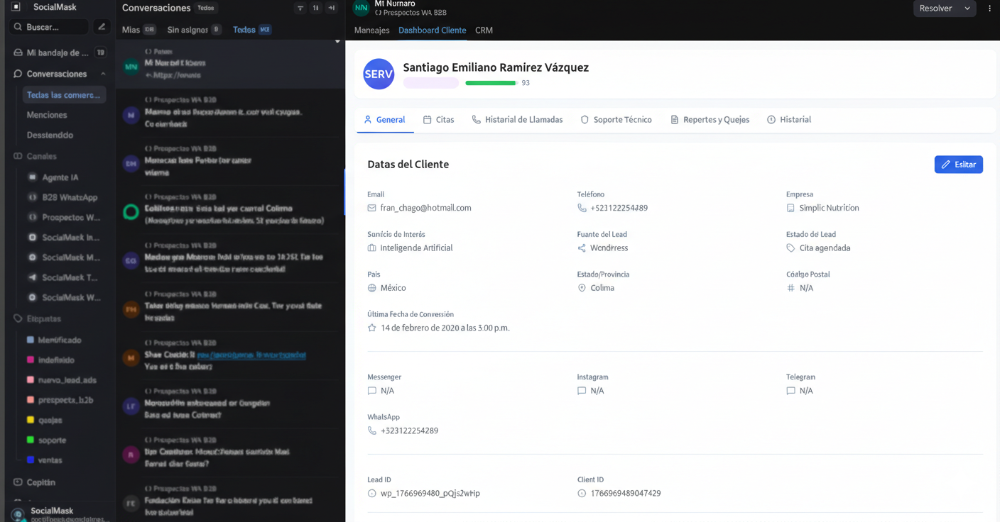
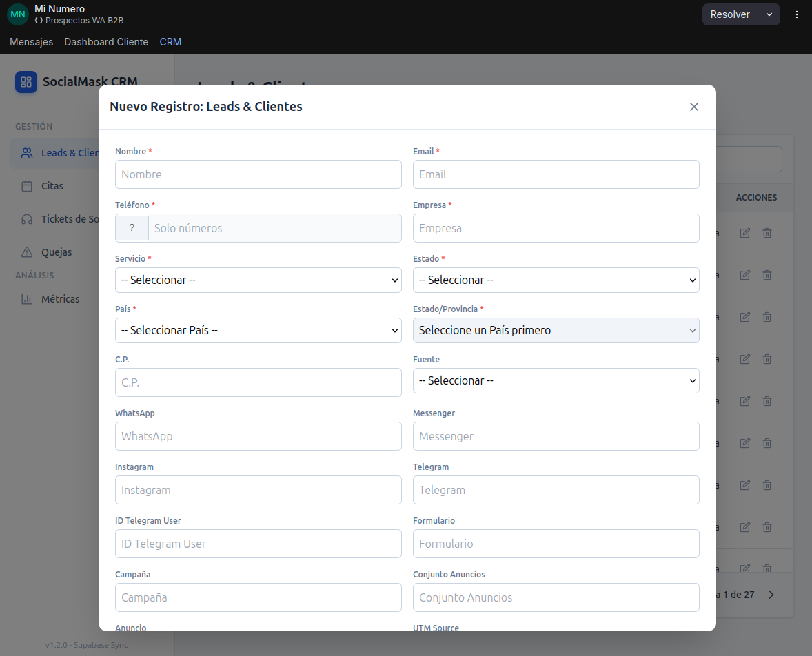
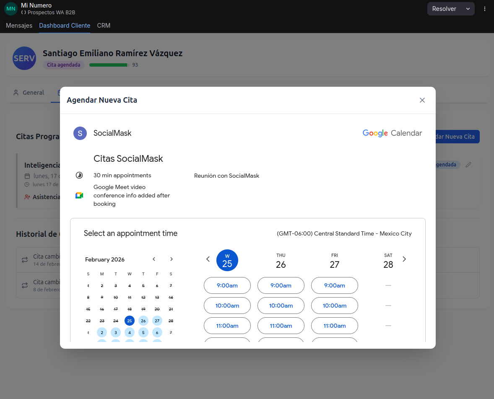

# 📊 Chatwoot Intelligent Dashboards (v2.0)

A collection of sophisticated automation backends that power custom interactive iFrames within the Chatwoot ecosystem. These workflows bridge the gap between customer conversations and operational tools (Google Calendar, CRM, WhatsApp).

## 🧩 Dashboard Components

The system is architected as a set of modular backends that respond to iFrame interactions:

### 1. 📅 Scheduling & Rescheduling Engine
- **File:** `agendar o reagendar cita manual chatwoot dashboard cliente.json`
- **Role:** High-performance bridge between the Booking iFrame and Google Calendar.
- **Features:** 
  - Real-time event creation/modification.
  - Multi-platform notifications (Gmail, WA, Telegram).
  - lead status synchronization in Supabase.
  - Automatic AI memory updates for conversational continuity.

### 2. ✕ Cancellation & Postponement Suite
- **File:** `Cancelar o Posponer cita manual chatwoot dashboard cliente.json`
- **Role:** Lifecycle manager for appointment changes.
- **Features:**
  - Automated cleanup of calendar items.
  - Polite cancellation/reprogramming logic via multichannel messaging.
  - Internal sales team alerting.

## 🖼️ Visual Experience

Below are demonstrations of how these workflows manifest within the Chatwoot interface:

| Customer Booking iFrame | CRM Agent Interaction | Google Calendar Integration |
| :---: | :---: | :---: |
|  |  |  |

## 🛠️ Performance & Security
- **Data Normalization:** A robust JavaScript layer ensures all customer PII is cleaned and formatted before database entry.
- **Sanitized for Portfolios:** All Webhook IDs, API Keys, and Personal Identifiable Information (PII) have been replaced with standard `your_placeholder` tokens.
- **Extensible Architecture:** Designed to work with any Postgres/Supabase schema with minimal configuration.

---
*Developed for high-conversion sales environments where timing and data accuracy are critical.*
